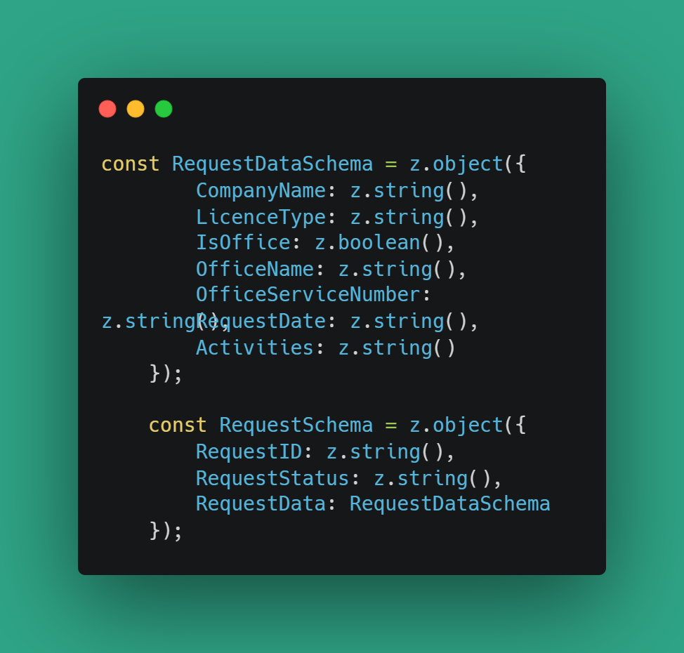

# solutionby42


## To install dependencies:

```bash
bun install
```

To run:

```bash
bun run index.ts
```

Express:

```bash
bun add @types/express
```

Multer:

```bash
bun add multer
```

CSV Parser:

```bash
bun add csv-parser
```

ZOD:

```bash
bun add zod
```

# index.ts File:

This project implements an API using Express.js to process CSV files, extract data, and store it in a SQLite database. It also provides endpoints to retrieve information about the imported data.

# dataExtraction.ts

In this file we have a couple of functions I will go through it on by one.

## createTables:
The createTables function is responsible for creating database tables if they do not already exist. It takes a database connection (db) as an argument and executes SQL statements to create tables for various types of requests. Each request type has its own table structure defined with specific columns.


## insertIntoDB:
Here's a breakdown of what the function does:

1. It prepares SQL insert statements for each type of request (e.g., NewLicenseRequest, AccountRequest, etc.).

2. It wraps the insertion process in a database transaction to ensure atomicity.

3. Within the transaction, it iterates over the categorized data and executes the prepared insert statements for each request type.


## processCSV:
The processCSV function asynchronously reads a CSV file located at the specified csvFilePath and categorizes its data based on the values in the "RequestType" column. It returns a promise that resolves with an object containing arrays of categorized data for different request types.


## getRecordCount:
The getRecordCount function retrieves the total number of records from a specified table in a SQLite database. It takes two parameters: tableName, which specifies the name of the table from which records are to be counted, and db, an instance of the SQLite Database class representing the database connection.

## retrieveCounts:
The retrieveCounts function retrieves the count of records in different tables from the database and returns an object containing these counts.


# zodvalidaition.ts

The validation functions validates a given record against a predefined schema using the Zod library.

for example this is the schema for NewLicense table:



Here is an example of the valid record:

.png)

Here is an example of the invalid record:

.png)

Please note that if the record is invalid it will not be inserted to the database.


     
